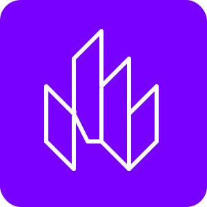

## light



Small sensible lit components made for one off uses.

## Include
```html
<script async src="https://manav.ch/r/dist:light?load.js"></script>
<!-- example: chip.js or split.js -->
```

### split
```html
<!-- default ratio is horizontal 1:1 -->
<lt-split disabled>
  <!-- disabled prevents resizing -->
  <div slot="a">1</div>
  <div slot="b">2</div>
</lt-split>

<!-- custom ratio -->
<lt-split vertical ratio="1:2">
  <div slot="a">1</div>
  <div slot="b">2</div>
</lt-split>
```

### chip
```html
<lt-chip>chip</lt-chip>

<!-- bg col and smaller -->
<lt-chip bg="#f00" scale="0.5">chip</lt-chip>
<!-- bg can only be hex or rgb -->
```

### Tex
```html
<lt-tex>\int_0^1 x^2 dx</lt-tex>

<lt-tex display>
\begin{bmatrix}
  1 & 2 \\
  3 & 4
\end{bmatrix}
</lt-tex>
```

### Mermaid
```html
<lt-mmd>
graph TD
  A[Christmas] -->|Get money| B(Go shopping)
  B --> C{Let me think}
  C -->|One| D[Laptop]
  C -->|Two| E[iPhone]
  C -->|Three| F[Car]
</lt-mmd>
```

### Frame
```html
<lt-frame>
  <template>
    <div>frame</div>
  </template>
</lt-frame>
```
